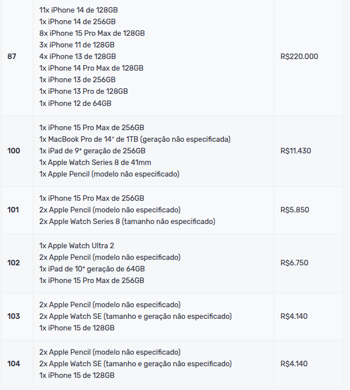
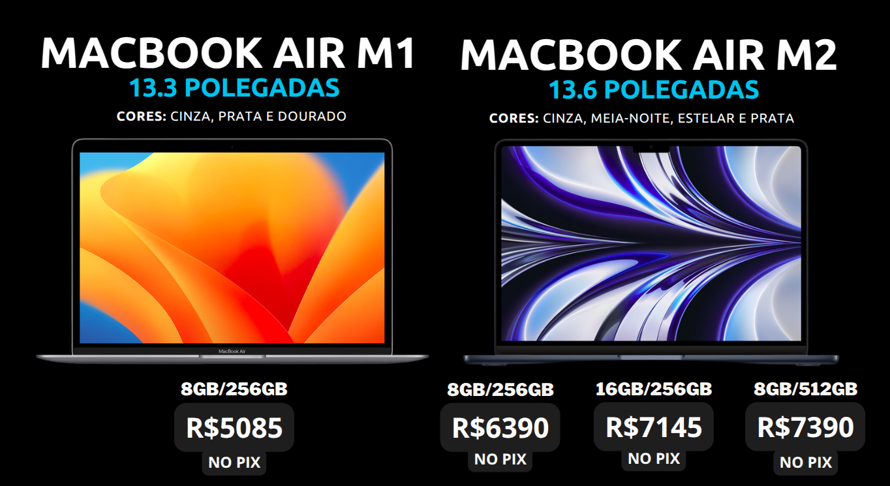
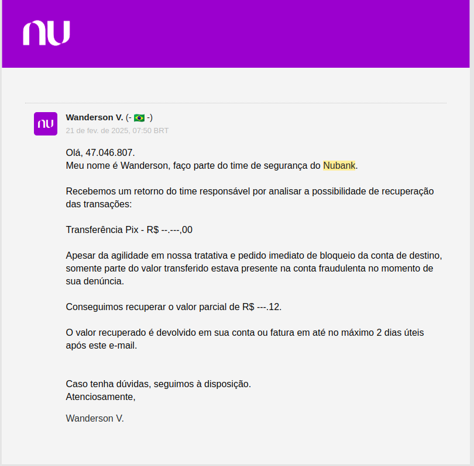

# 🚀 Astro Importados - A Jornada de uma Loja de Produtos Apple

## 🌟 Resumo do Projeto

A **Astro Importados** nasceu da busca por oportunidades no mercado de produtos Apple importados. Utilizando estratégias de **marketing digital e vendas**, conseguimos atingir um público-alvo qualificado, resultando em vendas expressivas e clientes fiéis.

Entretanto, como todo empreendimento de grande potencial, desafios também surgiram no caminho. Aqui está um relato de toda essa trajetória!

---

## 💡 O Surgimento da Ideia

A ideia da Astro Importados surgiu ao ver um **leilão de MacBooks apreendidos pela Receita Federal**. Os preços iniciais eram atrativos, com valores mínimos de **1.100 Reais**, enquanto no mercado custavam **6.000 Reais**.

Porém, ao entender melhor o sistema de lances, percebi que apenas quem tinha valores iniciais altos poderia competir, e no fim os produtos ainda saíam por cerca de **5.000 Reais**. Um bom negócio, mas não exatamente o que eu esperava.  

Foi então que meu irmão me apresentou uma loja vendendo produtos Apple por um preço **ainda menor** do que os encontrados nos leilões. Isso me intrigou: como conseguiam vender por valores tão competitivos? Será que importavam em grandes lotes?

Descobri que esses fornecedores importavam os produtos de maneira independente, sem depender de leilões ou revendedores tradicionais. Foi assim que decidi unir minha **experiência em marketing digital, vendas e dropshipping** para explorar esse mercado.

---

## 🚀 O Início do Projeto

Para dar o primeiro passo, fiz uma **pesquisa aprofundada** sobre fornecedores confiáveis. Viajei até o **Paraguai** e encontrei um fornecedor que passou segurança.

📦 **Primeira compra**: Um lote de produtos Apple que foi vendido rapidamente para contatos próximos. O sucesso inicial me incentivou a buscar mais fornecedores para garantir um **estoque constante e melhores preços**.

📱 **Expansão para o Instagram**: Comecei a divulgar os produtos pelas redes sociais e as vendas continuaram crescendo. Percebi que para escalar ainda mais, precisava de um **espaço físico** para gravar **unboxings, reviews e armazenar um maior volume de produtos**.

🏢 **Aquisição de um escritório**: O local servia como estúdio para conteúdo e também para facilitar a gestão do estoque e das vendas.

---

## ⏸️ A Primeira Pausa

Com o crescimento, investi na identidade da loja: **embalagens personalizadas, etiquetas, brindes** para os clientes e um planejamento para criar um estoque maior.

Porém, o mercado de importação envolve riscos. Após confiar em um fornecedor e enviar um **valor significativo**, fui surpreendido quando ele simplesmente **desapareceu com o dinheiro**. Mesmo tomando providências legais (**B.O e Mediação**), consegui recuperar **menos de 10% do valor total**.

Diante desse golpe, decidi **dar uma pausa, estudar o mercado e reavaliar as estratégias** antes de seguir adiante.

---

## 📊 Novas Estratégias para o Futuro

Com base na minha experiência, elaborei um plano dividido em **três níveis de investimento e risco**:

1️⃣ **Baixo custo e baixo risco** – Desenvolvimento de **sites, blogs e e-commerce** (modelo que estou explorando atualmente).

2️⃣ **Médio custo e médio risco** – Fabricação de **teclados personalizados**, inspirados no modelo **Tupinikeebs**.

3️⃣ **Alto custo e alto risco** – Retorno da **Astro Importados**, mas com um planejamento ainda mais sólido e um investimento robusto.

No futuro, pretendo retomar o projeto com uma abordagem **estrategicamente aprimorada**, maior **capital de giro** e um controle ainda mais rigoroso sobre fornecedores e logística.

A jornada da **Astro Importados** está apenas em pausa... Em breve, voltaremos ainda mais fortes! 💪✨

